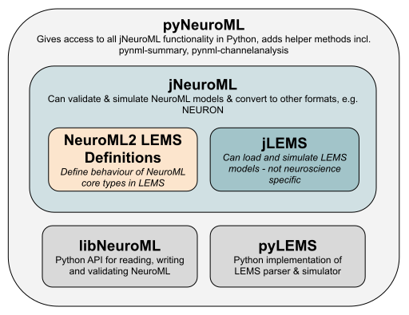

Introduction
============

This package provides PyNeuroML, for working with neuronal models specified in `NeuroML 2  <http://docs.neuroml.org>`_.

.. warning:: **PyNeuroML targets NeuroML v2.0**

   PyNeuroML targets `NeuroML v2.0`_, which is described in `Cannon et al, 2014 <http://journal.frontiersin.org/Journal/10.3389/fninf.2014.00079/abstract>`_).
   NeuroML v1.8.1 (`Gleeson et al. 2010 <http://www.ploscompbiol.org/article/info:doi/10.1371/journal.pcbi.1000815>`_) is now deprecated and not supported by PyNeuroML.

For a detailed description of PyNeuroML see :cite:t:`Vella2014`.
*Please cite the paper if you use PyNeuroML.*

PyNeuroML is a Python package that allows you to work with NeuroML models using the Python programming language.
It includes all the API functions provided by `libNeuroML <https://docs.neuroml.org/Userdocs/Software/libNeuroML.html>`__ and `pyLEMS <https://docs.neuroml.org/Userdocs/Software/pyLEMS.html>`__, and also wraps all the functions that `jNeuroML <https://docs.neuroml.org/Userdocs/Software/jNeuroML.html>`__ provides, which can therefore be used from within Python itself.

With pyNeuroML you can:

- **Create** NeuroML models and simulations
- **Validate** NeuroML v1.8.1 and v2.x files
- **Simulate** NeuroML 2 models
- **Export** NeuroML 2 and LEMS files to many formats such as Neuron, Brian, Matlab, etc.
- **Import** other languages into LEMS (e.g. SBML)
- **Visualise** NeuroML models and simulations

    Relationship between jLEMS, jNeuroML, the NeuroML 2 LEMS definitions, libNeuroML, pyLEMS and pyNeuroML.

.. _NeuroML v2.0: http://docs.neuroml.org
